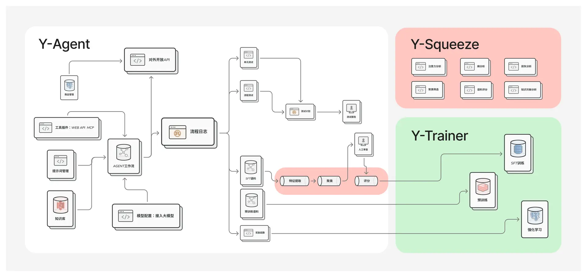
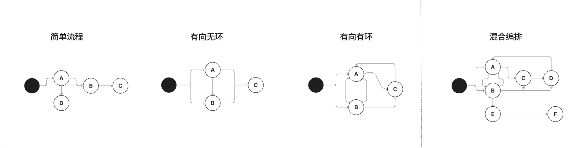

# 支持RAG评估、上下文工程、自动语料生产、模型微调
# 介绍
Y-Agent Studio 框架 完整开源，可商用，不区分社区版 商用版，下载后意味着您可以获得全部功能。

既保持了写代码一样的灵活性，又有便捷的可视化界面，可以进行流程编排迭代、自动化测试、语料标注与生产。

能解决：

- Agentic AI：复杂的流程编排，支持嵌套，有环的循环连接
- RAG评估：完善的日志系统，可以可视化展示、自动化分析
- MCP WebAPI：系统集成能力开放，与现有IT系统无缝集成
- 语料生产：自动化测试、语料标注、语料生产与管理
- 模型微调：垂直领域训练总是破坏模型能力的问题


## Y-Agent是其中核心模块
目前为Bate版，10月会发布正式版
Y-Agent，设计目标是 **最大化运行效率** 和 **应对复杂业务场景** ，这里主要介绍和大部分Agent框架不一样的特点。

### 下载安装

运行以下命令
创建conda环境
```
conda create --name y-agent python=3.11.8
```

启动conda环境
```
conda activate y-agent
```

安装依赖（注意命令所在目录）
```
cd y-agent
pip install -r requirements.txt
```
启动项目
```
python main.py
```
### 核心功能

| 功能         | 功能描述                                                                 |
|------------------|--------------------------------------------------------------------------|
| 复杂流程编排     | 有向有环图：多路并行、循环依赖执行、多上游依赖、自动选择下游节点、流程嵌套、自动结束等 |
| 节点间消息传递   | 全局变量传递、单节点变量传递、消息聊天室、工具结果传递                             |
| 知识库RAG        | 文本知识库、表格知识库                                                           |
| 多轮推理ReAct    |  系统内置ReAct能力                                                 |
| 测试             | 单元测试、流程测试                                                             |
| 并发设计         | 多任务分身                                                                 |
| 训练语料生产     | 预训练、SFT、强化学习                                                          |


## 系统架构图



## 核心概念
### 流程图
流程图就是核心组件，支持可视化编排，可以多智能体和固定流程混合模式。
#### 有向有环图
流程图的核心是有向有环图，可以实现以下流程：



#### 结束条件
流程只有开始节点，不设置结束节点，会自动判断结束时机。

结束条件：
- 所有根据内置算法，判定节点均已执行完毕
- 某个节点输出了 `command=|<|terminate(message="")|>|` 指令。系统会停止所有后续节点的执行。
#### 分身


分身是一种把 单个 提示词拆分成 多个提示词的技术。类似于孙悟空，拔毛分身成多个，然后同时做不同的事情。

拆分好的提示词，相当于多个分身，会并发的调用大模型。

<Callout type="info"> 
**分身**（拆分任务）的好处：
- 减少模型推理时间，提升效率。
- 让模型专注某一个任务，减少干扰，提升准确率。
</Callout>

因为大模型节点可以配置以下任务：
- 使用工具。
- 自动选择下游角色。
- 输出参数。

所有分身最多会有三个。同时分身功能和ReAct是互斥的。

具体案例，可以查看Y-Agent框架安装好，自带的案例。
> 以上分身是同时运行的，这样既保证速度，效果又好。缺点是，浪费token。

效果如下：


#### 工作空间


> 类似于人类协作的方式，可能存在 **多个角色** 共同编辑同一个变量。

所以定义了一个用于公共操作的空间“**工作空间变量**”，在提示词模板中使用“**space**”作为标记。


**工作空间变量** 分为三种类型，以满足不同的数据处理需求：覆盖型变量\追加型变量\不重复追加型变量

#### 聊天室

聊天室里存放各个节点间的消息传递，以及接待您发送给用户的消息，可以实现多Agent协作。


## 相关资料：

[Y-Agent Studio官方介绍](http://112.126.109.80/docs)

[Y-Agent 使用说明](http://112.126.109.80/docs/y-agent/quick_start)

[Y-Squeeze 使用说明](http://112.126.109.80/docs/y-squeeze/introduction)

[Y-Trainer 介绍](http://112.126.109.80/docs/y-trainer/introduction)

[Y-Agent Studio官网](http://112.126.109.80)


